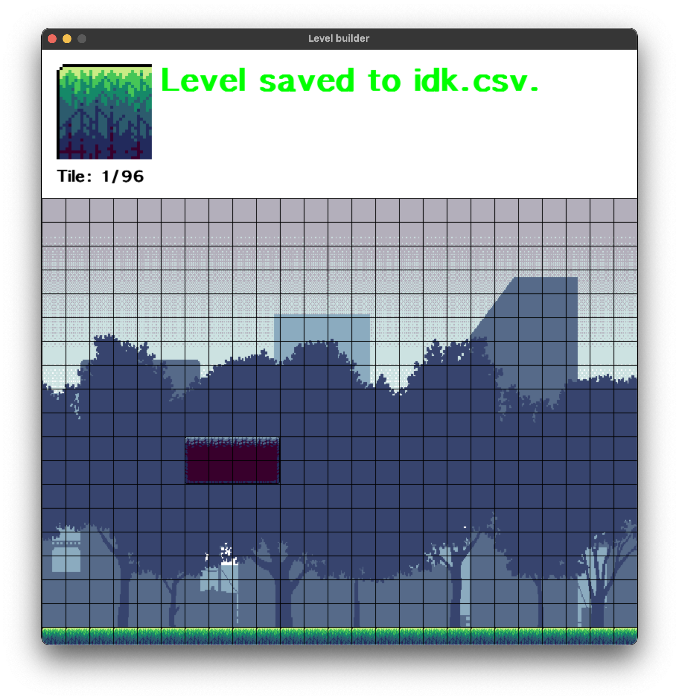

# Platformer level builder **(WIP)**

This is a simple tile-based level editor for my 2D platformer game, made entirely in pygame. Each tile is 32x32 pixels, and the editor is designed to be played on 800x600 pixel windows.

## Installation

To download:

    git clone https://github.com/DarkSoulWind/Platformer-Level-Builder.git

Before installing, dependencies must be installed if they don't already exist:

    pip install pygame

To run:

    cd Platformer-Level-Builder
    python main.py your-level.csv

On macOS, you may need to replace the `python` command with `python3`, as well as `pip` with `pip3`.

## Instructions

-   Use left click to paint a tile, and right click to remove it.
-   Cycle through the different tile types using the left and right arrow keys.
-   When you want to save the level, press S on the keyboard and the level will be saved to that file path.
-   **Note: If the file path specified as the argument doesn't exist, it will be created and written to upon saving.**
